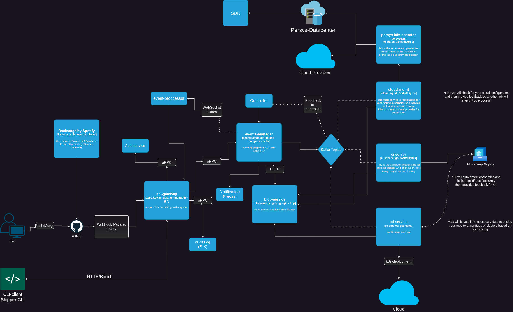
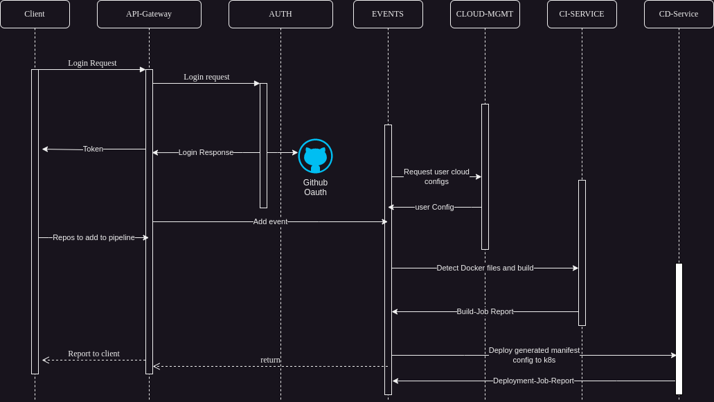

# persys-devops
**DevOps as a service platform!**
<br>
**i am working on a public version that soon will be released here! read [Updates](#Updates)**
<br>
**!!THIS PROJECT IS UNDER ACTIVE DEVELOPMENT DO NOT USE IN PRODUCTION!!**
<!-- TOC -->
* **[Architecture](#Architecture)**
* **[Updates](#Updates)**
* **[Contributions](#Contributions)**
* **[Open Source]()**
* **[Goals!](#Goals!)**
* **[Project RoadMap]()**
* **[Community](#community)**
* **[Services Description]()**
* **[Documentation](#Documentation)**
* **[CNCF](#Cloud Native Computing Foundation)**
<!-- TOC -->

# Architecture
* **this is the system design that i came up with, a high level mind map to look at.**
* feel free to open an ISSUE mentioning any problems or ideas you might have!

  

* **an over simplified request flow**

  

Open Source DevOps as a Service platform written in Golang with a rust CLI client called shipper!,
this project is aimed at making the life of DevOps engineers easy with automation.

# Local Development
1. First clone the repository:
```shell
git clone https://github.com/persys-dev/persys-devops
```
2. Then using make file you can do :
```shell
make up
```
3. As an alternative way you can simply run init.sh which will build and deploy the project to a kind environment:
```shell
chmod +x ./init.sh
./init.sh
```
# Getting started!
**you can use pure http rest requests/ CLI client to interact with our platform.**
<br>
<br>
**to keep it very simple:**
<br>
* download the CLI client or use Postman to interact with our api.
* login using gitHub oAuth.
* the application will read all of your repositories and list them so you can add them to your pipeline.
* our servers will prepare a kubernetes as a service for you or connect to your cloud provider.
* then we'll read your pipeline details from root of your repo and initialize all your required services for your app.if theres no pipeline manifest we will let you know!
* then add personal access tokens and set webhooks for your repositories.
* you can run a pipeline manually but when the application adds webhook to your repo you simply just need to push your code to github!
* push your code to github!
* monitor the building , tests , security , deployment!
* notify the project owner and/or your team!
  <br>
**that's it now you have a ci/cd pipeline + production environment!**
  <br>
  **refer to [getting-started.md](https://github.com/miladhzzzz/persys-cicd/docs/getting-started.md) for a better understanding of how this software works!**

# Updates
* **[8/12/2022] this whole thing is written by me so there's a lot to work on, i'll really appreciate any help!**
* **[10/3/2022] getting my hands on the hardware and infrastructures needed for developing this project has costs please consider donating to us!**
* **[12/24/2022] I'm actively trying to build a community so please at lease give us a star or contribute to our cause!**
* **[12/30/2022] currently the project has hard coded personal / sensitive data in it i'll release the first working version soon to our open source repository which is : https://github.com/miladhzzzz/persys-cicd**
* **[1/12/2023]  achieved first working version on my local environment cleanup is coming along good!**
* **[1/12/2023]  refactoring code to meet a modern microservice architecture boilerplate**
* **[1/12/2023]  changed the architecture! also working on a linear design that will be available soon!**
* **[1/25/2023]  im working on a working version for Azure to deploy the whole project and get a demo.**
* **[5/8/2023]   ok so theres a little bit of change involved in the architecture and some services were deleted we actually made the decision to not use a frontend at all! and rely completely on our cli client.**
* **[5/8/2023]   check the service description for seeing changes to the services!.**
* **[5/8/2023]   theye and js frontend directories are deprecated and will deleted soon.**
# Contributions
**we are looking for contributors in fields of expertise listed below:**
<br>
* DevOps Engineers
* Golang developers
* Rust developers
* Cloud network engineers
* Datacenter Architectures and designers
* Software test specialist
* Project managers

**please refer to community section and consider joining us**
[Community](#community)
# Open Source Tech We Use
* [Backstage](https://github.com/backstage/backstage)
* [apache kafka](https://github.com/obsidiandynamics/kafdrop)
* [gRPC](https://github.com/grpc)
* [Git]()
* [Rust (Programming Language)]()
* [Terraform]()
* [Kubernetes]()
* [Go (Programming Language)]()
* [OpenTelemtry](https://github.com/opentelemtry)
* [Watermill](https://github.com/watermill)
* [Mongodb](https://github.com/mongodb)
* [Signoz](https://github.com/signoz)
* [Kafdrop](https://github.com/obsidiandynamics/kafdrop)
* [Ceph](https://github.com/ceph)
* [Github](https://github.com)

# Goals!
**This project really started because of my own pain to setup a cluster and a CI/CD pipeline for one of my projects.
to give you a little bit of context i needed a platform that provided me with kubernetes and let me configure multiple clusters locally or in my vsphere environment if that makes sense!
in summary the goal of this project is** :
* giving you a nice cli tool to configure a live cluster either on-prem or on any cloud provider and very easy pipeline configuration.
* deployment to multi-clusters and actual cloud provider config management .


and of course what i have in mind is a platform like https://dev.azure.com but actually having kubernetes as a service in our platform is going to make everything easy!
<br>
but our shipper-cli (CLI-Client) actually makes it way easier than using a web based frontend!

# Project Road Map
* Q1 2023 : Clean UP the code repository for and rebase to public repository.
* Q1 2023 : Build our Community to help develop, manage , market our product.
* Q1 2023 : Test First Working version!
* Q2 2023 : Submit project to CNCF sandbox projects and integrate our community with the world!
* Q2 2023 : Hopefully we can get our hands on Infrastructure needed to launch our Hosted version of our software.
* Q3 2023 : Grow our Community and hire people to help!
* Q4 2023 : Release the software for on premise use (hosting it yourself).
* Q4 2023 : World Dominance :D.

# Services Description
* [api-gateway](https://github.com/miladhzzzz/persys-cicd) : a pretty basic api gateway that talks to the whole system (CLI-client send http rest calls and we generate gRPC calls to aggregation and use kafka to check on jobs)
* [ci-service](https://github.com/miladhzzzz/persys-cicd) : obviously does ci server stuff build your code test it and push it to a private and/or multiple repositories.
* [clients/cli(shipper-cli)](https://github.com/miladhzzzz/persys-cicd) : a cli interactive shell written in rust that communicates with api-gateway called shipper!.
* [DEPRECATED][clients/frontend-react](https://github.com/miladhzzzz/persys-cicd) : this is the frontend or dashboard of the project based on javascript frameworks using websockets for real-time data {DEPRECATED} !! WILL BE DELETED SOON.
* [events-manager](https://github.com/miladhzzzz/persys-cicd) : events manager is responsible for aggregating events throughout the whole system with kafka and has controller that check on jobs.
* [cd-service](https://github.com/miladhzzzz/persys-cicd) : shipper deploys your code to different types of environments (Cloud, On-Prem , etc...) getting your environment from cloud-mgmt.
* [DEPRECATED][theye](https://github.com/miladhzzzz/persys-cicd) : theye will keep an on "EYE" on system state and try to get desired state of the whole system talking to cloud-mgmt and ci-service , shipper {DEPRECATED} !! WILL BE DELETED SOON.
* [cloud-mgmt](https://github.com/miladhzzzz/persys-cicd) : this is a datacenter-cloud inter-connect fabric that will be responsible for kubernetes-as-a-service on persys-cloud or your cloud-provider.
* [blob-service](https://github.com/miladhzzzz/persys-cicd) : a very simple stateless in-cluster blob storage {Golang, Gin}.
* [audit-service](https://github.com/miladhzzzz/persys-cicd) : an audit log ledger something like WAL records in database systems / collects all the logs for ELK from every service.
* [auth-service](https://github.com/miladhzzzz/persys-cicd) : auth service is a authorization / authentication service.

# Documentation
**the documentation will be located at https://github.com/miladhzzzz/persys-devops/docs**
* [getting-started.md](https://github.com/miladhzzzz/persys-cicd/docs/getting-started.md)
* [how-it-works.md](https://github.com/miladhzzzz/persys-cicd/docs/how-it-works.md)
* [install.md](https://github.com/miladhzzzz/persys-cicd/install.md)
* [architecture.md](https://github.com/miladhzzzz/persys-cicd/architecture.md)
* [contributions.md](https://github.com/miladhzzzz/persys-cicd/contributions.md)

# Community
**Our primary goal in this project as we discussed before is to build a community of iranian highly skilled
specialists to help each other and junior developers in a way that we can write great software that is maintained by
community contributions.**
<br>
and of course integrating our community with the world of Open Source!
<br>
we can find a lot of great software that is written by millions of Open Source contributors accross the globe in https://github.com/readme
<br>
you can join "your" community and start contributing in various projects! please visit our slack or discord (will be updated soon) to ask around and have a dialogue with others!
<br>
https://join.slack.com/t/persys-cicd/shared_invite/zt-1lje1wst0-E0TjKMIXGe1FGLex1uQoxg


# Cloud Native Computing Foundation
<br>
this project is currently in the sandbox waiting list of Cloud Native Computing Foundation, and as we mentioned above we are using and supporting a lot of CNCF technologies
<br>
so, thank you 

[CNCF](https://github.com/miladhzzzz/persys-cicd) <3

